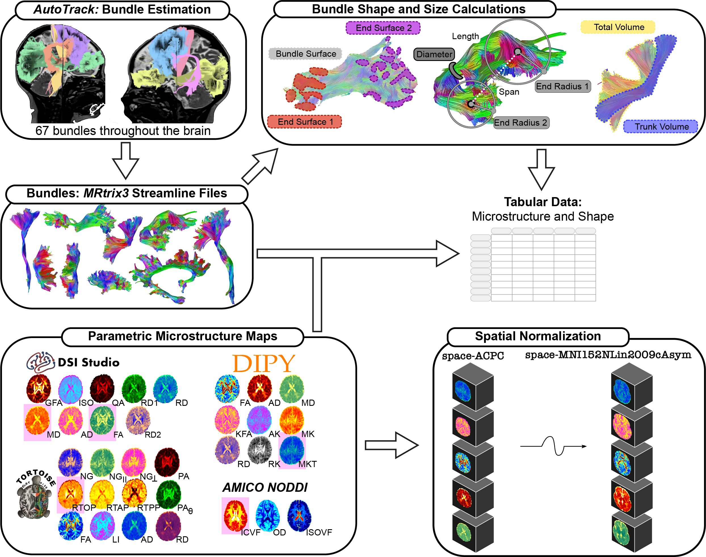

# Postprocessing

## QSIRecon
```{warning}
The full script cannot be run again in its current form because the S3 buckets used for centralized data storage that we download QSIPrep results from and upload QSIRecon results to are no longer in service since the data release was completed. These code snippets are provided here as a reference for what options were used.
```
For the current iteration of ABCC 3.1.0, we used [QSIRecon](https://qsiprecon.readthedocs.io/en/latest/usage.html) to postprocess the data.

QSIRecon 1.0.0rc2 was run with the following script (CUBIC:`/cbica/projects/abcd_qsiprep/s3qsiprep/code/s3_abcc_release_recon.sh`, [GitHub](https://github.com/PennLINC/Meisler_ABCD_dMRI/tree/main/scripts/0_processing/qsirecon/s3_abcc_release_recon.sh)) with the options:

```bash
singularity run \
    --containall \
    -B ${PWD} \
    -B "${TEMPLATEFLOW_HOME}:/templateflow_home" \
    --env "TEMPLATEFLOW_HOME=/templateflow_home" \
    ${SIMG} \
    ${PWD}/qsiprep \
    ${PWD}/results \
    participant \
    -w ${PWD}/wkdir \
    --report-output-level session \
    --stop-on-first-crash \
    --fs-license-file ${PWD}/license.txt \
    --participant-label "$subid" \
    --recon-spec ${PWD}/ABCD_Recon.yml \
    --notrack -v -v \
    --nthreads ${NSLOTS} \
    --omp-nthreads ${NSLOTS}
```

and the following `ABCD_Recon.yml` file (CUBIC: `/cbica/projects/abcd_qsiprep/s3qsiprep/code/ABCD_Recon.yml`, [GitHub](https://github.com/PennLINC/Meisler_ABCD_dMRI/tree/main/scripts/0_processing/qsirecon/ABCD_Recon.yml)):
```yaml
name: ABCD_Recon
nodes:
# NODDI with WM parameters
-   action: fit_noddi
    input: qsirecon
    name: fit_noddi_wm
    parameters:
        dIso: 0.003
        dPar: 0.0017
        isExvivo: false
    qsirecon_suffix: wmNODDI
    software: AMICO
# NODDI with GM parameters
-   action: fit_noddi
    input: qsirecon
    name: fit_noddi_gm
    parameters:
        dIso: 0.003
        dPar: 0.0011
        isExvivo: false
    qsirecon_suffix: gmNODDI
    software: AMICO
# DIPY diffusion kurtosis modeling
-   action: DKI_reconstruction
    input: qsirecon
    name: dipy_dki
    parameters:
        write_fibgz: false
        write_mif: false
    qsirecon_suffix: DIPYDKI
    software: Dipy
# TORTOISE MAPMRI w/ small b-val tensor fit
-   action: estimate
    input: qsirecon
    name: tortoise_dtmapmri
    parameters:
        big_delta: null
        estimate_mapmri:
            map_order: 4
        estimate_tensor:
            bval_cutoff: 1200
            write_cs: true
        estimate_tensor_separately: true
        small_delta: null
    qsirecon_suffix: TORTOISE_model-MAPMRI
    software: TORTOISE
# Fit the GQI model to the data
-   action: reconstruction
    input: qsirecon
    name: dsistudio_gqi
    parameters:
        method: gqi
    qsirecon_suffix: DSIStudioGQI
    software: DSI Studio
# Get 3D images of DSI Studio's scalar maps
-   action: export
    input: dsistudio_gqi
    name: gqi_scalars
    qsirecon_suffix: DSIStudioGQI
    software: DSI Studio
 # Perform the registration using the GQI-based QA+ISO
-   action: autotrack_registration
    input: dsistudio_gqi
    name: autotrack_gqi_registration
    # qsirecon_suffix: Don't include here - the map.gz is saved in autotrack
    software: DSI Studio
# Do MSMT on all shells
-   action: csd
    software: MRTrix3
    input: qsirecon
    name: msmt_csd
    parameters:
        fod:
            algorithm: msmt_csd
            max_sh:
            - 8
            - 8
            - 8
        mtnormalize: true
        response:
            algorithm: dhollander
    qsirecon_suffix: MSMTAutoTrack
# Merge the FOD fib file and the map file
-   action: fod_fib_merge
    name: create_fod_fib_msmt
    # to include the fib file AND the map file
    input: autotrack_gqi_registration
    csd_input: msmt_csd
    # outputs include the FOD fib file and the map file is passed through
    qsirecon_suffix: MSMTAutoTrack
    parameters:
        model: msmt
# Execute AutoTrack
-   action: autotrack
    input: create_fod_fib_msmt
    name: autotrack_fod_msmt
    parameters:
        tolerance: 22,26,30
        track_id: Association,Projection,Commissure,Cerebellum
        track_voxel_ratio: 2.0
        yield_rate: 1.0e-06
        model: msmt
    qsirecon_suffix: MSMTAutoTrack
    software: DSI Studio
# Map scalars to bundles
-   action: bundle_map
    input: autotrack_fod_msmt
    name: bundle_means
    scalars_from:
    - fit_noddi_wm
    - dipy_dki
    - tortoise_dtmapmri
    - gqi_scalars
    software: qsirecon
# Map scalars to MNI
-   action: template_map
    input: qsirecon
    name: template_map
    parameters:
        interpolation: NearestNeighbor
    scalars_from:
    - fit_noddi_wm
    - fit_noddi_gm
    - dipy_dki
    - tortoise_dtmapmri
    - gqi_scalars
    software: qsirecon
```

```{warning}
`gmNODDI` was not uploaded to ABCC final production bucket due to being experimental.
```

Briefly this included the following workflows (see the [_QSIrecon_ documentation](https://qsirecon.readthedocs.io/en/latest/usage.html) for more information):
- `DSI Studio AutoTrack` for tractography
- Macrostructural bundle statistic calculation
- Generalized q-space imaging (GQI), including an inner shell (_b_ < 1250) for tensor fitting
- NODDI for WM and GM
- DKI from DIPY (which includes tensor components)
- MAP-MRI from TORTOISE with an inner shell (_b_ < 1250) for tensor fitting
- Mapping all scalars to bundles
- Normalizing all scalars to MNI space

We adapted the figure from [Cieslak et al., _(Under Review)_](https://www.biorxiv.org/content/10.1101/2025.11.10.687672v2) to showcase the reconstruction outputs (Figure 2). Therefore, **no code is associated with this figure**.


```{note}
We cannot share the postprocessed data publicly due to the terms of the ABCD Data Use Agreement.
```
