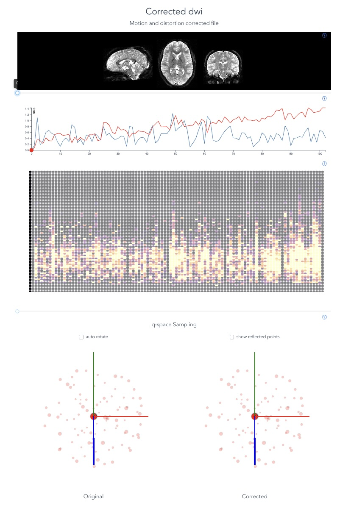
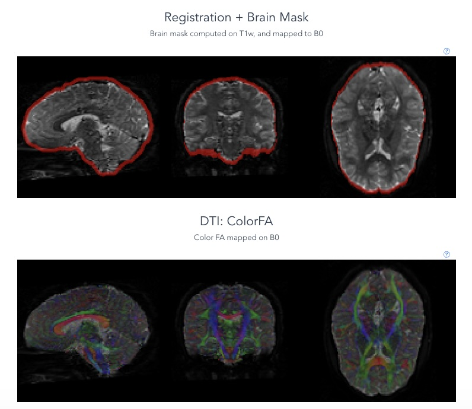

# Manual Quality Control Training

This step involved (1) preparing training materials for image reviewers; (2) creating samples of images for each rater to rate; (3) collecting image ratings from the reviewers

```{note}
We did this in two rounds (first Siemens, then GE/Philips). We started with Siemens because it made up most of the ABCD sample, and had the highest overall quality. Additionally, the Philips data wouldn't process correctly first. The Philips data were collected in two runs instead of one, and originally the second run had an incorrect gradient table associated with it. It was eventually corrected.
```

## The Training Materials

Matt and I made training videos to introduce the raters to the rating process. This also involved descriptions of common artifacts. These videos can be found on the [Open Science Foundation repository](https://osf.io/89uya/).

In `manual_qc/training_videos/Siemens_Image_Quality.mp4`, we demonstrate common image quality artifacts in Siemens data. This includes descriptions of good data, bad data (i.e., different kinds of artifacts), and which artifacts are most deleterious.

In `manual_qc/training_videos/GE_Philips_Image_Quality.mp4`, we demonstrate common image quality artifacts in GE and Philips data. This includes descriptions of good data, bad data (i.e., different kinds of artifacts), and which artifacts are most deleterious.

In `manual_qc/training_videos/How_to_Rate_Data.mp4`, we show how to rate data. This involves loading the QC JSON files to the [_dmriprep-viewer_](https://www.nipreps.org/dmriprep-viewer/#/), navigating the viewer interface, submitting ratings, and saving them.

```{note}
You will notice that the GE and Philips images look systematically worse due to a lower contrast-to-noise ratio. In general, reviewers were instructed to focus on overall **practical usability** of the dMRI. In other words, a single noisy volume might be acceptable if the remainder of the series was clean. However, issues that were pervasive across the entire time series, such as poor brain masking, severe motion corruption, or systemic noise, warranted a fail.
```

Raters were then given a "quiz" consisting of 10 hand-selected images that each rater was asked to rate. While some of these images were passing, others contained specific artifacts that were good to attend to. Although there is no “ground truth”, an answer key (written by authors S.L.M. and M.C.) provided explanations for how expert raters would likely rate the images in the quiz set.

An example quiz feedback form / answer key may be found the OSF repo in `manual_qc/quiz_answer_key.html`.

```{note}
We cannot share these all of these images due to restrictions on the ABCD Data Use Agreement and for the privacy of the image reviewers.
```


## Creating the Rater Subsets

To get the images to raters, we had to make an algorithm to create subsets of the QC JSONs for each rater. We did this with specific counter-balancing in mind.

When we rated the **Siemens** data, a team of 23 trained reviewers evaluated images. During this stage 1,771 Siemens dMRI images from the baseline session were randomly selected so that, across all combinations of our 23 reviewers taken three at a time, each image would receive exactly three independent ratings. Each reviewer rated 231 images equally distributed across 7 quality percentile bins (indexed by the unmasked processed NDC), and each reviewer was paired with each other reviewer 21 times to gauge inter-rater reliability.

This subsetting was done with the following notebook: [scripts/quality_classifier/generate_rater_subsets/create_rater_subsets_siemens.ipynb](https://github.com/PennLINC/Meisler_ABCD_dMRI/blob/main/scripts/quality_classifier/generate_rater_subsets/create_rater_subsets_siemens.ipynb).

For the GE and Philips data, a team of 21 raters (XX of these raters overlapped with the Siemens reviewers) reviewed a total of 1,330 dMRI images, with 665 images coming from each GE and Philips. Each reviewer rated 190 images, with the GE-to-Philips split being roughly half, again divided across 7 quality percentile bins. Each image was rated by 3 reviewers, and raters were paired with one another 19 times to gauge inter-rater reliability.

This subsetting was done with the following notebook: [scripts/quality_classifier/generate_rater_subsets/create_rater_subsets_GE_Philips.ipynb](https://github.com/PennLINC/Meisler_ABCD_dMRI/blob/main/scripts/quality_classifier/generate_rater_subsets/create_rater_subsets_GE_Philips.ipynb). 

Since data infrastructure changed between rating the Siemens data and the rest of the data, we had to do an additional step to gather the QC JSON inputs for the _dmriprep-viewer_. Using the `rater_assignments.py` produced by `create_rater_subsets_GE_Philips.ipynb`, we parsed assignments into `s5cmd` download commands to fetch the corresponding QC JSON files from centralized storage. Those helper scripts were site-specific CUBIC utilities and are not included in this repository.

## The _dmriprep-viewer_ Interface

The _dmriprep-viewer_ is a web application that allows you to view and rate images. It is available [here](https://www.nipreps.org/dmriprep-viewer/#/). The input to the _dmriprep-viewer_ is the QC JSON files located in the _QSIPrep_ outputs: e.g., `sub-XX/ses-YY/dwi/sub-XX_ses-YY_dwiqc.json`. The viewer interface is shown in the figures below. It allows the user to scroll through the time series, see motion time series, view slice-wise noise estimates, see the T1w-to-dMRI registration, and explore a color fractional anisotropy (FA) map.




Each reviewer assigned every image an integer score from –2 (“definitely fail”) to +2 (“definitely pass”), with 0 indicating uncertainty. Collections of ratings were saved as `.csv` files to be analyzed later.

```{note}
Since these ratings contain subject IDs and session IDs, we cannot share these ratings publicly. They are available on CUBIC at `/cbica/projects/abcd_qsiprep/XXX`.
```
